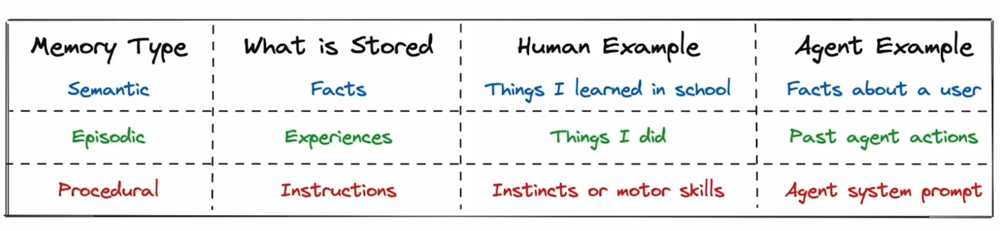
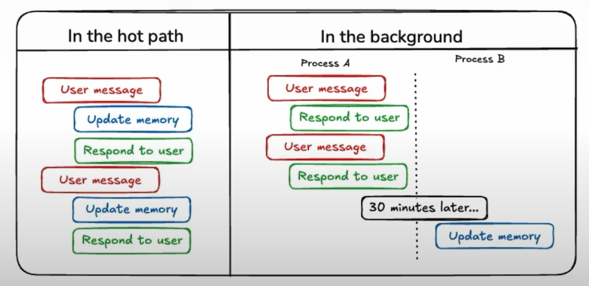
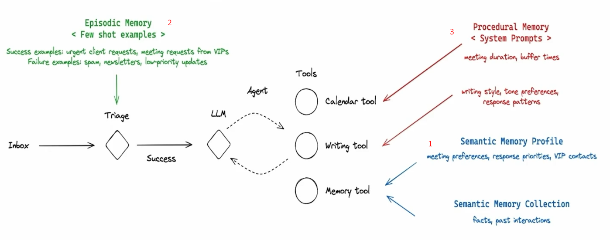

# Introduction

Summarize the content from the course https://learn.deeplearning.ai/courses/long-term-agentic-memory-with-langgraph/lesson/mp33x/introduction-to-agent-memory

This course focuses on build Email assistant to support classify the email (important or ignore)

## What types of memory?
There are three types of memory
- Semantic (Facts)
- Episode (Experiences)
- Procedural (Instructions)

## How to store memory
- Two different ways: Along with hot path (current flow) or in the background

## Picture about using memory in email agent

